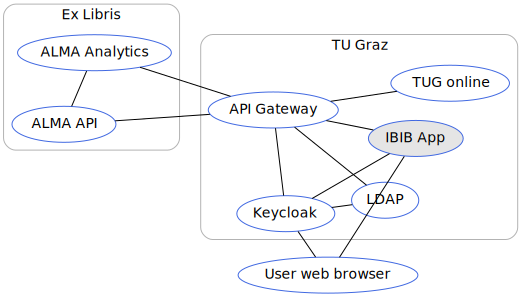

# Library Application

[GitLab Repository](https://gitlab.tugraz.at/dbp/library/library) |
[npmjs package](https://www.npmjs.com/package/@dbp-topics/library) |
[Unpkg CDN](https://unpkg.com/browse/@dbp-topics/library/)



## Prerequisites

- You need library officer permissions to be allowed to use the application
- You need the [API server](https://gitlab.tugraz.at/dbp/middleware/api) running on <http://127.0.0.1:8001> or access the [official api server](https://api.tugraz.at/)

## Local development

```bash
# get the source
git clone git@gitlab.tugraz.at:dbp/library/library.git
cd library
git submodule update --init

# install dependencies
yarn install

# constantly build dist/bundle.js and run a local web-server on port 8001 
yarn run watch-local

# run tests
yarn test
```

Jump to <http://localhost:8001> and you should get a Single Sign On login page.

Example book barcodes: `+F58330104`, `+F58019101`, `+F53498803`


## Remote development

<https://mw-frontend-dev.tugraz.at/apps/library>

Run `yarn run watch-dev` to build the `dist/bundle.js` constantly and upload the `dist` folder to the server.

## Roll back a release

```bash
COMPOSER_VENDOR_DIR=_temp composer require "deployer/deployer" "deployer/recipes"
# Check if the config is pointing to the server you want
./_temp/bin/dep config:hosts production
# Do the rollback
./_temp/bin/dep rollback production
```

## Demo system

<https://frontend-demo.tugraz.at/apps/library>

Build bundle for the demo environment

```bash
APP_ENV=demo yarn run build
```

## Using this app as pre-built package

Not only you can use this app as pre-built package installed from [npmjs](https://www.npmjs.com/package/@dbp-topics/library) via:

```bash
npm install @dbp-topics/library
```

But you can also use this app directly from the [Unpkg CDN](https://unpkg.com/browse/@dbp-topics/library/)
for example like this:

```html
<!doctype html>
<html>
<head>
    <meta charset="UTF-8">
    <meta name="viewport" content="width=device-width, initial-scale=1">

    <!-- Favicons -->
    <link rel="shortcut icon" type="image/x-icon" href="https://unpkg.com/@dbp-topics/library@1.0.1/dist/local/@dbp-topics/library/favicon.ico">
    <link rel="icon" type="image/svg+xml" href="https://unpkg.com/@dbp-topics/library@1.0.1/dist/local/@dbp-topics/library/favicon.svg" sizes="any">

    <!-- PWA manfiest file -->
    <link rel="manifest" href="https://unpkg.com/@dbp-topics/library@1.0.1/dist/dbp-library.manifest.json">

    <!-- Loading spinner -->
    <script type="module">
        import {Spinner} from 'https://unpkg.com/@dbp-topics/library@1.0.1/dist/local/@dbp-topics/library/spinner.js';
        customElements.define('dbp-loading-spinner', Spinner);
    </script>

    <!-- App bundles-->
    <script type="module" src="https://unpkg.com/@dbp-topics/library@1.0.1/dist/dbp-library.js"></script>

    <!-- Prevent Chrome/Edge from suggesting to translate the page -->
    <meta name="google" content="notranslate">

    <!-- Font related CSS -->
    <style>
        @import "https://unpkg.com/@dbp-topics/library@1.0.1/dist/local/@dbp-topics/library/fonts/source-sans-pro/300.css";
        @import "https://unpkg.com/@dbp-topics/library@1.0.1/dist/local/@dbp-topics/library/fonts/source-sans-pro/400.css";
        @import "https://unpkg.com/@dbp-topics/library@1.0.1/dist/local/@dbp-topics/library/fonts/source-sans-pro/600.css";

        body {
            font-family: 'Source Sans Pro', 'Calibri', 'Arial', 'sans-serif';
            font-weight: 300;
            margin: 0;
        }

        /* TU-Graz style override */
        html {
            --dbp-override-primary-bg-color: #245b78;
            --dbp-override-info-bg-color: #245b78;
            --dbp-override-danger-bg-color: #e4154b;
            --dbp-override-warning-bg-color: #ffe183;
            --dbp-override-warning-text-color: black;
            --dbp-override-success-bg-color: #259207;
        }
    </style>

    <!-- Preloading/Preconnecting -->
    <link rel="preconnect" href="https://mw-dev.tugraz.at">
    <link rel="preconnect" href="https://auth-dev.tugraz.at/auth">
    <script type="module" src="https://auth-dev.tugraz.at/auth/js/keycloak.min.js"></script>
</head>

<body>
<dbp-library
        lang="de"
        entry-point-url="https://mw-dev.tugraz.at"
        auth
        analytics-event
        requested-login-status
        src="https://unpkg.com/@dbp-topics/library@1.0.1/dist/dbp-library.topic.metadata.json"
        base-path="/"
        keycloak-config='{"url": "https://auth-dev.tugraz.at/auth", "realm": "tugraz", "clientId": "auth-dev-mw-frontend-local", "silentCheckSsoRedirectUri": "./silent-check-sso.html"}'
        env='local'
        matomo-url='https://analytics.tugraz.at/'
        matomo-site-id='131'
><dbp-loading-spinner></dbp-loading-spinner></dbp-library>

<!-- Error handling for too old browsers -->
<script src="https://unpkg.com/@dbp-topics/library@1.0.1/dist/local/@dbp-topics/library/browser-check.js" defer></script>
<noscript>Diese Applikation benötigt Javascript / This application requires Javascript</noscript>
</body>
</html>
```

Note that you will need a Keycloak server along with a client id for the domain you are running this html on.
