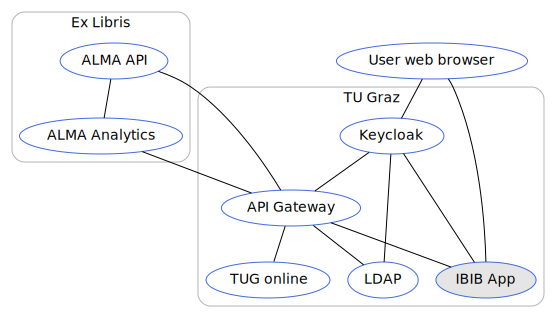

# Library Application

[GitLab Repository](https://gitlab.tugraz.at/dbp/library/library) |
[npmjs package](https://www.npmjs.com/package/@dbp-topics/library) |
[Unpkg CDN](https://unpkg.com/browse/@dbp-topics/library/)



## Prerequisites

- You need library officer permissions to be allowed to use the application
- You need the [API server](https://gitlab.tugraz.at/dbp/middleware/api) running on <http://127.0.0.1:8001> or access the [official api server](https://api.tugraz.at/)

## Local development

```bash
# get the source
git clone git@gitlab.tugraz.at:dbp/library/library.git
cd library
git submodule update --init

# install dependencies
yarn install

# constantly build dist/bundle.js and run a local web-server on port 8001 
yarn run watch-local

# run tests
yarn test
```

Jump to <http://localhost:8001> and you should get a Single Sign On login page.

Example book barcodes: `+F58330104`, `+F58019101`, `+F53498803`


## Remote development

<https://dvp-dev.tugraz.at/apps/library>

Run `yarn run watch-dev` to build the `dist/bundle.js` constantly and upload the `dist` folder to the server.

## Roll back a release

```bash
COMPOSER_VENDOR_DIR=_temp composer require "deployer/deployer" "deployer/recipes"
# Check if the config is pointing to the server you want
./_temp/bin/dep config:hosts production
# Do the rollback
./_temp/bin/dep rollback production
```

## Demo system

<https://dbp-demo.tugraz.at/apps/library>

Build bundle for the demo environment

```bash
APP_ENV=demo yarn run build
```

## Using this app as pre-built package

### Install app

If you want to install the DBP Library App in a new folder `library-app` with a path prefix `/` you can call:

```bash
npx @digital-blueprint/cli install-app library library-app /
```

Afterwards you can point your Apache web-server to `library-app/public`.

Make sure you are allowing `.htaccess` files in your Apache configuration.

Also make sure to add all of your resources you are using (like your API and Keycloak servers) to the
`Content-Security-Policy` in your `library-app/public/.htaccess`, so the browser allows access to those sites.

You can also use this app directly from the [Unpkg CDN](https://unpkg.com/browse/@dbp-topics/library/)
for example like this: [dbp-library/index.html](https://gitlab.tugraz.at/dbp/library/library/-/tree/master/examples/dbp-library/index.html)

Note that you will need a Keycloak server along with a client id for the domain you are running this html on.

### Update app

If you want to update the DBP Library App in the current folder you can call:

```bash
npx @digital-blueprint/cli update-app library
```

## "dbp-library" Slots

These are common slots for the appshell. You can find the documentation of these slot in the `README.md` of the appshell webcomponent.

## Design Note

To ensure a uniform and responsive design the activity should occupy 100% of the window width when the activity width is less than 768 px.

## Mandatory attributes

If you are not using the `provider-root` attribute to "terminate" all provider attributes
you need to manually add these attributes so that the topic will work properly:

```html
<dbp-library
    auth
    requested-login-status
    analytics-event
>
</dbp-library>
```
